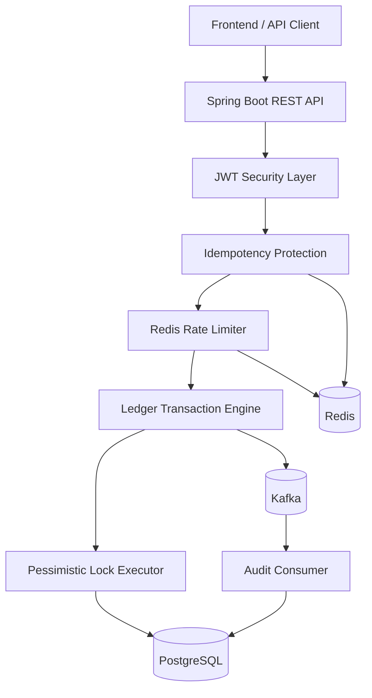

<div align="center">

# LedgerCore
### Enterprise Banking Transaction Ledger Engine

A production-style **high-concurrency banking backend system** simulating mission-critical financial transaction processing used in modern banking systems.

Built with **Java 21, Spring Boot, PostgreSQL, Redis, Kafka, JWT Security, and Docker**.

<p align="center">
  
  
  
  
  
  
</p>

<p align="center">
  <a href="https://github.com/hruthvikkm6/LedgerCore">Repository</a> •
  <a href="#architecture">Architecture</a> •
  <a href="#tech-stack">Tech Stack</a> •
  <a href="#api-overview">API Overview</a> •
  <a href="#contact">Contact</a>
</p>

</div>

---

# Overview

**LedgerCore** is a production-style banking transaction ledger backend built to simulate the engineering challenges faced by real-world financial systems.

Unlike traditional CRUD portfolio projects, LedgerCore focuses on **backend engineering complexity**, including:

- Safe concurrent transaction processing
- Double-entry accounting consistency
- Duplicate transaction prevention
- Velocity fraud protection
- Event-driven audit architecture
- Enterprise-grade access control
- Financial data integrity under high concurrency

This project demonstrates backend patterns commonly used in:

- Banking platforms
- Payment processors
- Fintech infrastructure
- Wallet systems
- High-integrity transaction services

---

# Why This Project Exists

Most portfolio projects demonstrate CRUD.

LedgerCore was intentionally built to solve **real engineering problems**:

- What happens when two users transfer money simultaneously?
- How do we prevent duplicate payments if a client retries?
- How do banks guarantee transaction consistency?
- How can fraud velocity be controlled at the API boundary?
- How should auditing be decoupled from the transaction engine?

This project answers those questions through practical implementation.

---

# Project Preview


---

# Engineering Highlights

## Concurrency-Safe Transaction Engine

Financial systems cannot tolerate race conditions.

LedgerCore prevents double-spend and inconsistent balances using:

- ACID transactional boundaries
- `SELECT ... FOR UPDATE`
- Pessimistic row locking
- Deterministic lock ordering
- Atomic transfer execution

**Result:** safe concurrent financial transactions.

---

## Double-Entry Ledger Accounting

Every financial operation creates balanced accounting entries.

Example:

```text
Transfer ₹10,000

Debit  : Sender Account
Credit : Receiver Account
```

Guarantee:

```text
Total Debits = Total Credits
```

This mirrors real-world banking ledger design.

---

## Idempotent Financial APIs

Client retries can accidentally trigger duplicate money movement.

Implemented protection:

- HTTP `Idempotency-Key`
- Redis fast duplicate lookup
- PostgreSQL fallback verification
- Cached duplicate response replay

**Result:** identical requests are processed only once.

---

## Redis Sliding Window Rate Limiter

Velocity fraud protection implemented using Redis Sorted Sets.

Example:

```text
Maximum 3 transactions / 60 seconds
```

Prevents:

- rapid fraud attempts
- bot abuse
- transaction flooding
- API misuse

---

## Event-Driven Audit Pipeline

Transaction processing emits Kafka events asynchronously.

Flow:

```text
Transaction Posted
      ↓
Kafka Event Published
      ↓
Audit Consumer Processing
      ↓
Immutable Audit Persistence
```

Benefits:

- loose coupling
- scalability
- clean architecture
- asynchronous processing

---

# Architecture

## High-Level System Architecture



---

## Layered Architecture

```text
Client Layer
     ↓
REST Controller Layer
     ↓
Security / Filter Layer
     ↓
Service / Business Logic Layer
     ↓
Repository / Persistence Layer
     ↓
Database / Cache / Event Infrastructure
```

---

# Tech Stack

## Backend

- Java 21
- Spring Boot 3
- Spring MVC
- Spring Security
- Spring Data JPA
- Hibernate
- Maven

---

## Database

- PostgreSQL
- Flyway Migrations

---

## Distributed Components

- Redis
- Apache Kafka

---

## Security

- JWT Authentication
- BCrypt Password Hashing
- Role-Based Access Control
- Idempotency Protection

---

## DevOps / Tooling

- Docker
- Docker Compose
- Git
- GitHub
- Postman
- IntelliJ IDEA

---

# Features

## Authentication & Authorization

- User registration
- Secure login
- JWT authentication
- Role-based access control
- Protected API access

---

## Account Management

- Create financial accounts
- Freeze accounts
- Unfreeze accounts
- View owned accounts
- Admin account oversight

---

## Transaction Processing

- Deposit funds
- Withdraw funds
- Transfer funds
- View transaction history
- Generate PDF account statements

---

## Operational Controls

- Ledger reconciliation
- Audit validation
- Integrity verification

---

# API Overview

## Authentication APIs

```http
POST /api/auth/signup
POST /api/auth/login
```

---

## Account APIs

```http
POST /api/accounts
GET  /api/accounts/my
GET  /api/accounts/{accountNumber}
POST /api/accounts/{accountNumber}/freeze
POST /api/accounts/{accountNumber}/unfreeze
```

---

## Transaction APIs

```http
POST /api/transactions/deposit
POST /api/transactions/withdraw
POST /api/transactions/transfer
GET  /api/transactions/{accountNumber}/history
GET  /api/transactions/{accountNumber}/statement
```

---

## Operations APIs

```http
POST /api/ops/reconcile
```

---

## Example API Request

```http
POST /api/transactions/transfer
Authorization: Bearer <jwt_token>
Idempotency-Key: 9f34b6f8-1827-4f81-b2fa-31a6f9a3c2e1
Content-Type: application/json

{
  "fromAccount": "123456789012",
  "toAccount": "987654321012",
  "amount": 10000
}
```

---

# Project Structure

```text
LedgerCore/
│
├── src/main/java/com/bank/ledger/
│   ├── controller/
│   ├── service/
│   ├── repository/
│   ├── domain/
│   ├── dto/
│   ├── security/
│   ├── filters/
│   ├── config/
│   ├── event/
│   └── exception/
│
├── src/main/resources/
│   ├── db/migration/
│   ├── static/
│   └── application.yml
│
├── docker-compose.yml
├── pom.xml
└── README.md
```

---

# Local Setup

## Clone Repository

```bash
git clone https://github.com/hruthvikkm6/LedgerCore.git
cd LedgerCore
```

---

## Start Infrastructure

```bash
docker-compose up -d
```

---

## Build Application

```bash
mvn clean package
```

---

## Run Application

```bash
java -jar target/banking-ledger-system.jar
```

Application runs at:

```bash
http://localhost:8080
```

---

# Engineering Challenges Solved

## Preventing Double-Spend

Solved using:

- pessimistic locking
- atomic transactions
- strict transaction boundaries

---

## Eliminating Duplicate Transactions

Solved using:

- idempotency keys
- Redis duplicate cache
- replay-safe responses

---

## Preventing Deadlocks

Solved using:

- deterministic lock acquisition ordering

---

## Fraud Velocity Protection

Solved using:

- Redis sliding window rate limiting

---

## Financial Integrity Assurance

Solved using:

- double-entry accounting
- reconciliation validation
- immutable transaction history

---

# Why This Project Stands Out

Most portfolio projects demonstrate simple CRUD operations.

LedgerCore demonstrates:

✅ concurrency engineering  
✅ financial transaction integrity  
✅ distributed caching patterns  
✅ event-driven architecture  
✅ API safety mechanisms  
✅ backend security design  
✅ enterprise architectural thinking

This project reflects real backend engineering beyond tutorial-level development.

---

# Future Improvements

Potential production-scale enhancements:

- multi-currency support
- transaction reversal workflows
- anomaly detection engine
- notification services
- distributed tracing
- observability dashboards
- benchmarking with JMH
- Kubernetes deployment

---

# Contact

## Hruthvik K M

**Java Backend Engineer**

📧 hruthvikkm6@gmail.com  
💻 GitHub: https://github.com/hruthvikkm6  
💼 LinkedIn: https://linkedin.com/in/hruthvikkm

---

# License

This project is created for educational, portfolio, and demonstration purposes.
